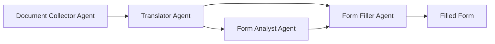

# Vietnamese Document Form Filler (CrewAI Edition)

🤖 **A CrewAI-powered multi-agent system** for processing Vietnamese documents (PDFs/images) and filling English DOCX forms using local Ollama LLMs.

## ✨ Features

### 🤖 CrewAI Multi-Agent Architecture
- **Document Collector Agent**: Extracts text using traditional OCR or AI vision models
- **Translator Agent**: Translates Vietnamese to English with context awareness
- **Form Analyst Agent**: Analyzes DOCX form structure and identifies fields
- **Form Filler Agent**: Intelligently maps content to form fields

### 🔧 Dual Extraction Methods
- **Traditional**: PyMuPDF + Tesseract OCR (fast, reliable)
- **AI-Powered**: Vision models (better for complex layouts, handwriting)

### 🚀 Multiple Interfaces
- **CLI**: Powerful command-line with async processing
- **Web Interface**: Modern Streamlit GUI with CrewAI visualization
- **Batch Processing**: Parallel processing with multiple CrewAI crews

### 🔒 Privacy-First
- **100% Local Processing**: No cloud dependencies
- **No API Keys Required**: Uses local Ollama models
- **Secure**: All processing happens on your machine
- **No Telemetry**: Built-in tracking blocker prevents any data collection

## 🚀 Quick Start

### 1. Prerequisites

Ensure you have:
- Python 3.10 or newer (up to Python 3.12)
- Ollama installed and running

```bash
# Install Ollama (visit ollama.ai for your platform)
curl -fsSL https://ollama.ai/install.sh | sh

# Install required models
ollama pull llama3.2:3b    # For translation and form filling
ollama pull llava:7b       # For AI-powered extraction (optional)
```

### 2. Installation

```bash
# Clone repository
git clone https://github.com/yourusername/form-filler
cd form-filler

# Install uv if you don't have it
curl -fsSL https://astral.sh/uv/install.sh | bash

# Create and activate virtual environment
uv venv
source .venv/bin/activate  # On Windows: .venv\Scripts\activate

# Install dependencies
uv pip install -e "."

# For web interface, install with web extra
uv pip install -e ".[web]"
```

### 3. Process Your First Document

```bash
# Traditional extraction
form-filler process input.pdf form.docx output.docx

# AI-powered extraction
form-filler -e ai -vm llava:7b process input.pdf form.docx output.docx

# Web interface
streamlit run src/streamlit/web_interface.py
```

## 🤖 CrewAI Architecture

### Agent Workflow



### Agent Details

#### 1. Document Collector Agent
```python
Role: Document Text Extractor
Goal: Extract text from Vietnamese documents with high accuracy
Tools: DocumentExtractionTool (traditional/AI)
```

#### 2. Translator Agent
```python
Role: Vietnamese to English Translator
Goal: Provide accurate contextual translations
Tools: TranslationTool (with ChatOllama)
```

#### 3. Form Analyst Agent
```python
Role: Document Form Analyst
Goal: Analyze DOCX forms and identify fillable fields
Tools: FormAnalysisTool
```

#### 4. Form Filler Agent
```python
Role: Form Completion Specialist
Goal: Fill forms with intelligent field mapping
Tools: FormFillingTool (AI-assisted)
```

## 📖 Usage

### CLI Commands

```bash
# Basic processing
form-filler process SOURCE FORM OUTPUT

# Batch processing with CrewAI
form-filler-batch process-directory input/ form.docx output/

# Check CrewAI status
form-filler-batch crew-status

# Extract text only
form-filler extract document.pdf

# Translate text only
form-filler translate "Xin chào"
```

### CLI Options

```bash
# Use AI extraction
-e ai --vision-model llava:7b

# Use different text model
-m llama3.1:8b

# Batch processing with multiple crews
-c 5  # 5 concurrent CrewAI teams

# Verbose output
-v
```

### Web Interface

Launch the Streamlit interface:
```bash
streamlit run src/streamlit/web_interface.py
```

Features:
- 🤖 CrewAI workflow visualization
- 📊 Real-time agent progress tracking
- 📈 Crew performance metrics
- 🔧 Agent configuration options
- 📁 Batch processing with multiple crews

## 🔧 Configuration

### CrewAI Settings (config.json)
```json
{
  "crewai_settings": {
    "process_type": "sequential",
    "verbose": true,
    "max_retries": 3,
    "timeout_per_task": 300
  },
  "agent_models": {
    "text_model": "llama3.2:3b",
    "vision_model": "llava:7b"
  },
  "extraction_settings": {
    "default_method": "traditional",
    "ai_fallback": true
  }
}
```

### Model Recommendations

| Use Case | Text Model | Vision Model | Extraction |
|----------|------------|--------------|------------|
| **Fast Processing** | llama3.2:3b | N/A | traditional |
| **High Accuracy** | llama3.1:8b | llava:13b | ai |
| **Balanced** | qwen2.5:7b | llava:7b | traditional |


## 📊 Performance Comparison

| Aspect | Traditional Agents | CrewAI Agents |
|--------|-------------------|---------------|
| **Architecture** | Custom implementation | Structured framework |
| **Error Handling** | Manual | Built-in retries |
| **Observability** | Basic logging | Comprehensive tracking |
| **Scalability** | Manual parallelization | Native concurrency |
| **Maintainability** | Custom abstractions | Standard patterns |

## 🧪 Demo

Run the interactive demo:
```bash
python src/demo.py
```

Features demonstrated:
- 🤖 CrewAI agent collaboration
- 🔄 Traditional vs AI extraction
- 📊 Batch processing with multiple crews
- ⚡ Error handling and recovery
- ⚙️ Configuration options

## 🛠️ Development

### Adding Custom Agents

```python
from crewai import Agent
from crewai.tools import BaseTool

class CustomTool(BaseTool):
    name = "custom_tool"
    description = "Description of what this tool does"

    def _run(self, input_data: str) -> str:
        # Tool implementation
        return processed_data

def create_custom_agent() -> Agent:
    return Agent(
        role='Custom Agent Role',
        goal='Specific goal for this agent',
        backstory='Background and expertise',
        tools=[CustomTool()],
        verbose=True
    )
```

### Extending the Crew

```python
class ExtendedProcessingCrew(DocumentProcessingCrew):
    def __init__(self, **kwargs):
        super().__init__(**kwargs)
        self.custom_agent = create_custom_agent()

    def process_with_custom_agent(self, *args):
        # Add custom agent to workflow
        pass
```

## 🔍 Troubleshooting

### CrewAI Issues

**Agent Initialization Errors**:
```bash
# Check CrewAI installation
pip install crewai crewai-tools

# Verify Ollama connection
curl http://localhost:11434/api/tags
```

**Tool Execution Failures**:
- Verify file permissions
- Check tool-specific requirements
- Review agent logs in verbose mode

**Performance Issues**:
- Reduce concurrent crews: `-c 2`
- Use lighter models: `-m llama3.2:3b`
- Switch to traditional extraction: `-e traditional`

### Model Issues

**Missing Models**:
```bash
# List available models
ollama list

# Install missing models
ollama pull llama3.2:3b
ollama pull llava:7b
```

## 📚 Documentation

All the documentation you need is right here in this README and the following files:

- **[REFACTORING.md](REFACTORING.md)**: Details about the project structure and future work
- **[CrewAI Integration Guide](crewai_integration_guide.md)**: Technical details about CrewAI integration
- **Pre-commit Hooks**: See the [Pre-commit Hooks](#pre-commit-hooks) section in this README

## 🤝 Contributing

We welcome contributions! Areas where help is needed:

1. **New Agent Types**: Document validators, form generators
2. **Enhanced Tools**: Better form understanding, multi-format support
3. **Performance**: Optimization for large documents
4. **Language Support**: Additional language pairs
5. **Testing**: Expand test coverage

### Development Setup

We use [uv](https://github.com/astral-sh/uv) for faster and more reliable package management and [poethepoet (poe)](https://github.com/nat-n/poethepoet) for task management.

```bash
# Clone repository
git clone https://github.com/yourusername/form-filler
cd form-filler

# Install uv if you don't have it
curl -fsSL https://astral.sh/uv/install.sh | bash

# Create and activate virtual environment
uv venv
source .venv/bin/activate  # On Windows: .venv\Scripts\activate

# Install dependencies with dev extras
uv pip install -e ".[dev]" poethepoet
# Or use the poe task (after installing poethepoet)
poe install-dev

# Available tasks (run with 'poe <task-name>'):
poe --help  # List all available tasks

# Common tasks
poe test          # Run tests
poe test-cov      # Run tests with coverage report
poe ruff-check    # Check code with ruff linter
poe ruff-fix      # Fix code with ruff linter
poe full-lint     # Run all linting checks
poe run-lint      # Run comprehensive linting script
poe run-demo      # Run the CrewAI demo
poe run-web       # Launch the web interface
poe serve         # Same as run-web
poe clean         # Clean build artifacts and caches
poe version       # Show the current package version

# Installation tasks
poe install       # Install the package in development mode
poe install-dev   # Install with development dependencies
poe install-web   # Install with web interface dependencies
poe install-all   # Install all dependencies (dev, web, monitoring)
poe install-hooks # Install pre-commit hooks in current virtualenv

# Pre-commit and security tasks
poe setup-secrets-detection          # Set up gitleaks configuration
poe force-setup-secrets-detection    # Force overwrite gitleaks configuration
```

### Pre-commit Hooks

This project uses pre-commit hooks to ensure code quality and prevent secrets from being committed to the repository.

```bash
# Install pre-commit hooks
poe install-hooks
```

#### Installed Hooks

- **trailing-whitespace**: Removes trailing whitespace
- **end-of-file-fixer**: Ensures files end with a newline
- **check-yaml**: Validates YAML files
- **check-added-large-files**: Prevents large files from being committed
- **check-merge-conflict**: Checks for unresolved merge conflicts
- **debug-statements**: Checks for debug statements (e.g., pdb, ipdb)
- **detect-private-key**: Prevents private keys from being committed
- **no-commit-to-branch**: Prevents direct commits to main/master branches
- **gitleaks**: Advanced secret detection to prevent credentials from being committed
- **detect-aws-credentials**: Specific check for AWS credentials in code
- **ruff**: Python linting with error checking and auto-fixes
- **ruff-format**: Python code formatting
- **bandit**: Python security checks for common vulnerabilities
- **full-lint**: Comprehensive linting (runs all checks at once)

#### Using Pre-commit Hooks

Install the hooks:
```bash
poe install-hooks
```

Run hooks manually:
```bash
pre-commit run --all-files
```

Run full linting separately:
```bash
./scripts/run_lint.sh
```

Bypass hooks (not recommended):
```bash
git commit --no-verify
```

#### Custom Secret Detection

You can customize the secret detection rules by modifying the gitleaks configuration:

```bash
# Set up gitleaks config (if it doesn't exist)
poe setup-secrets-detection

# Force overwrite existing config
poe force-setup-secrets-detection
```

This creates a `.gitleaks.toml` file with rules for detecting:
- API keys and tokens
- Database connection strings
- Crypto seeds/salts
- Environment variables with secrets
- Other sensitive information

The project's documentation consists of this README and the REFACTORING.md file, which contains details about the recent code restructuring and next steps. No additional documentation site is needed.

## 📄 License

MIT License - see [LICENSE](LICENSE) for details.

## 🙏 Acknowledgments

- **CrewAI Team**: For the excellent multi-agent framework
- **Ollama Team**: For local LLM inference capabilities
- **Langchain**: For LLM integration abstractions
- **Community Contributors**: Everyone improving this project

## 📞 Support

- **Issues**: [GitHub Issues](https://github.com/yourusername/form-filler/issues)
- **Discussions**: [GitHub Discussions](https://github.com/yourusername/form-filler/discussions)
- **Documentation**: All documentation is in this README, including pre-commit hooks information

---

**🚀 Start processing with CrewAI agents today!**

```bash
# Get started in 5 commands
git clone https://github.com/yourusername/form-filler
cd form-filler
uv venv
source .venv/bin/activate  # On Windows: .venv\Scripts\activate
uv pip install -e "." poethepoet && poe run-demo
```

*Built with ❤️ using CrewAI, Ollama, and Python*
